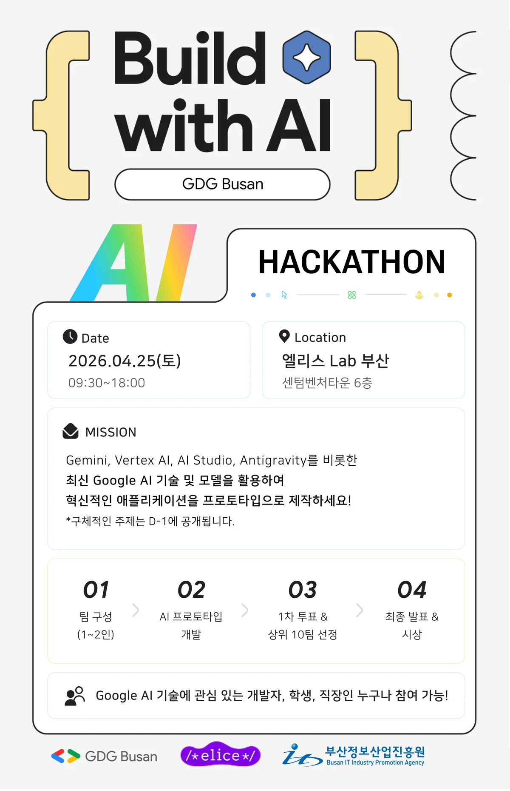
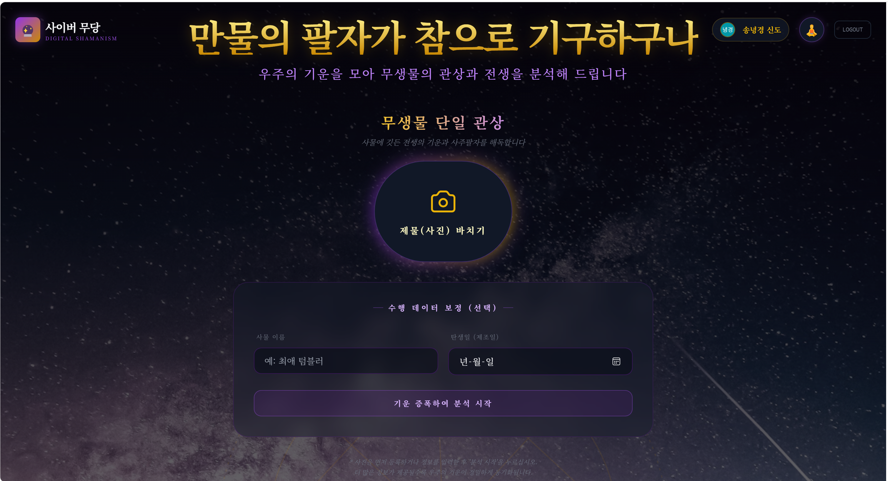
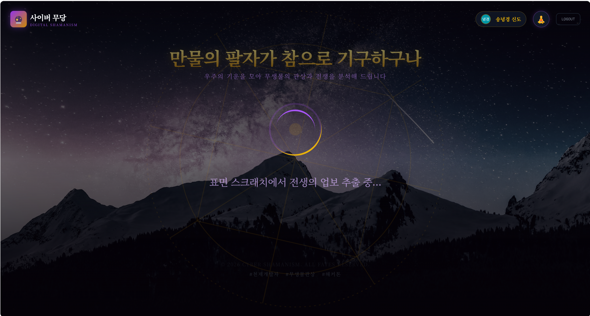
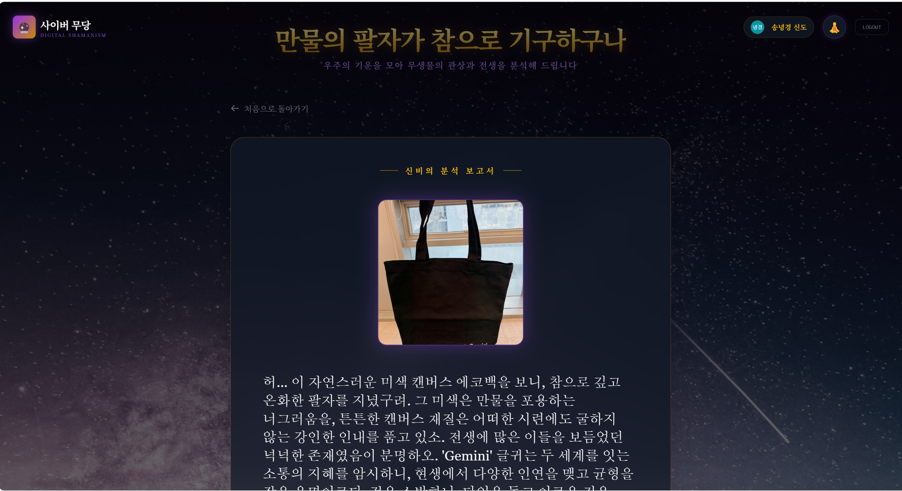
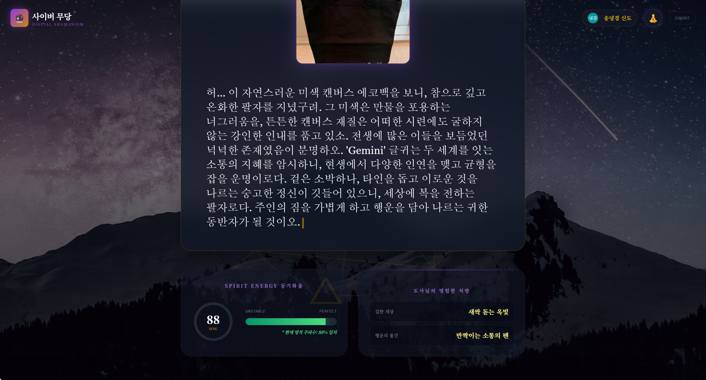
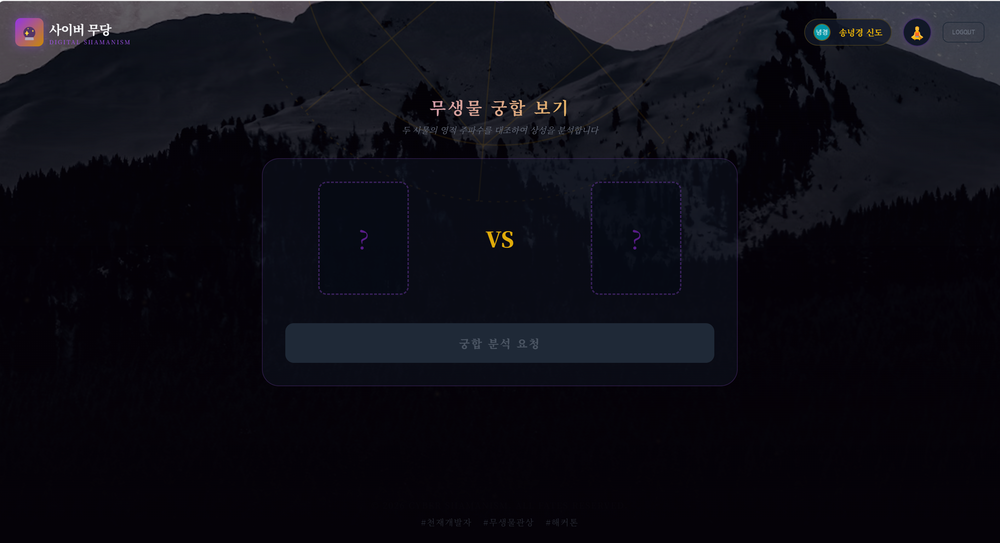
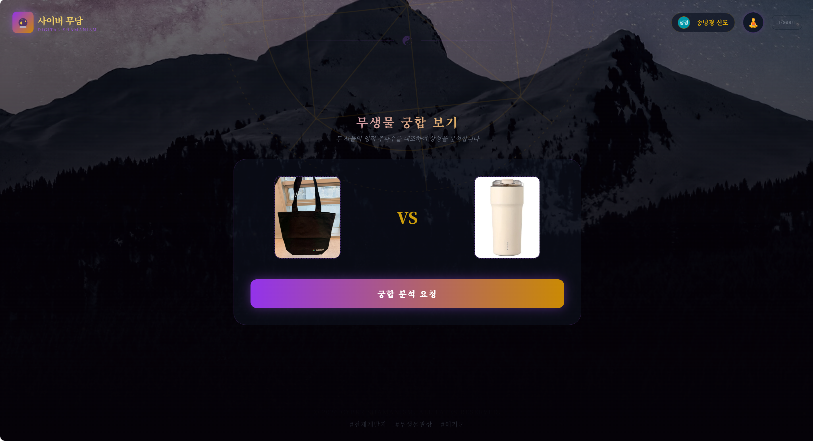

# 🔮 무생물 운명 스캐너 (Destiny Scanner) 

> **"먼저 사람들을 웃게 만들고, 그다음에는 생각하게 만든다"** — 이그노벨상 정신을 담은 AI 프로젝트 

500년 경력의 명리학자 **무용(無用)거사**가 당신의 물건 사진을 보고 전생과 팔자, 그리고 두 물건의 영적 궁합을 진지하게 풀이해드립니다. 완벽하게 쓸모없지만, 기술은 진지합니다.
<br/>

## 📖 프로젝트 개요 (Project Overview)

**무생물 운명 스캐너**는 GDG 해커톤 *'쓸모없는 AI 만들기 (Useless AI Championship)'* 에서 탄생한 프로젝트입니다.

- 물건 사진 1장 → **관상·팔자 분석** ("이 텀블러의 전생은 계곡의 돌이로다...")
- 물건 사진 2장 → **영적 궁합 분석** ("에코백과 텀블러의 상성은 수극화(水剋火)로다...")

진지한 말투와 황당한 내용의 조합으로 헛웃음과 사고의 전환을 동시에 유발합니다.

**개발 기간:** 2026.04 (1일 해커톤)  
**행사:** GDG 해커톤 - 쓸모없는 AI 만들기  
**백엔드 개발:** [nyeonggyeong](https://github.com/nyeonggyeong)

<!-- 행사 이미지 -->


<br/>

## 🛠️ 기술 스택 (Tech Stack)

### Backend
  

### AI
 

### Deployment & Infrastructure
 

### Frontend (별도 레포)
   

### Dev Tool


<br/>

## ✨ 주요 기능 (Key Features)

### 1. 🧿 단일 사물 관상·팔자 분석

   

물건 사진 1장을 업로드하면 무용거사가 그 물건의 전생, 팔자, 주인과의 기묘한 인연을 풀이합니다.

- 사진 속 물건의 **색상·재질·형태**를 실제로 읽고 구체적으로 언급
- 진지한 도사 말투로 황당한 분석 제공
- 궁합 점수, 행운의 색상, 행운의 물건 반환

### 2. 💫 두 물건 영적 궁합 분석

<!-- 궁합 결과 스크린샷 -->



물건 사진 2장을 업로드하면 두 사물의 영적 상성을 명리학적으로 분석합니다.

- 두 물건 각각의 기운을 **색상 조화·재질·용도**로 대조
- 상생(相生)과 상극(相剋)으로 궁합 점수 산출
- 궁합을 강화할 제3의 물건 추천

### 3. 🤖 Gemini 멀티모달 이미지 분석

- **이미지 1~2장을 직접 Gemini에 전달**하여 실제 사진 내용 기반 분석
- 프롬프트 엔지니어링으로 캐릭터 일관성 유지
- 모호한 답변을 방지하는 **절대 규칙** 시스템 적용

<br/>

## ⚙️ 시스템 아키텍처 (Architecture)

```
사용자
  │
  ▼
React 프론트엔드 (Vercel)
  │  multipart/form-data (file, file2, item_name, birth_date)
  ▼
FastAPI 백엔드 (Google Cloud Run, 서울 리전)
  │
  ├─ 이미지 1장 → [단일 관상 모드]
  └─ 이미지 2장 → [궁합 모드]
                        │
                 Gemini 2.5 Flash API
                 (멀티모달, 이미지 직접 분석)
                        │
                 JSON 응답 반환
          {result_text, fortune_score, lucky_color, lucky_item}
```

### Prompt Engineering (프롬프트 설계)
- **절대 규칙**: 사진 속 물건을 구체적 명칭으로 반드시 언급
- **형식 강제**: 모호한 "무형의 기운" 같은 답변 금지
- **모드 분기**: 사진 수에 따라 관상용/궁합용 프롬프트 자동 선택

<br/>

## 🚀 배포 정보 (Deployment)

**백엔드 API URL:**
```
https://destiny-scanner-backend-248895382472.asia-northeast3.run.app
```

**헬스체크:**
```
GET / → {"status": "ok", "message": "Destiny Scanner API is running."}
```

**분석 엔드포인트:**
```
POST /analyze
Content-Type: multipart/form-data

Fields:
  - file             : 첫 번째 물건 이미지 (필수)
  - file2            : 두 번째 물건 이미지 (궁합 시 추가)
  - item_name        : 물건 이름/설명 (선택)
  - birth_date       : 주인 생년월일 (선택)
  - prompt_extension : 추가 지시사항 (선택)

Response:
  {
    "result_text": "허허... 이 분홍색 텀블러의 기운을 보아하니...",
    "fortune_score": 73,
    "lucky_color": "썩은 무화과 빛 보라",
    "lucky_item": "3년 묵은 고무줄"
  }
```

<br/>

## 🗂️ 로컬 실행 방법 (Local Setup)

```bash
# 1. 클론
git clone https://github.com/nyeonggyeong/DestinyScanner-Backend.git
cd DestinyScanner-Backend

# 2. 패키지 설치
pip install -r requirements.txt

# 3. 환경변수 설정
echo "GOOGLE_API_KEY=your_gemini_api_key" > .env

# 4. 서버 실행
uvicorn main:app --host 0.0.0.0 --port 8080 --reload
```

**Docker로 실행:**
```bash
docker build -t destiny-scanner .
docker run -p 8080:8080 -e GOOGLE_API_KEY=your_key destiny-scanner
```

<br/>

## 🔗 관련 링크

| 역할 | 링크 |
|------|------|
| 🖥️ 프론트엔드 배포 (Live) | [https://gdg-hackathon-eta.vercel.app](https://gdg-hackathon-eta.vercel.app) |
| 🔧 백엔드 API (Live) | [https://destiny-scanner-backend-248895382472.asia-northeast3.run.app](https://destiny-scanner-backend-248895382472.asia-northeast3.run.app) |
| 📁 백엔드 레포 (현재) | [DestinyScanner-Backend](https://github.com/nyeonggyeong/DestinyScanner-Backend) |
| 📁 프론트엔드 레포 | [GDG_Hackathon](https://github.com/minyook/GDG_Hackathon) |

<br/>

## 💡 기술적 의의

> 이 서비스는 완벽하게 쓸모없습니다.  
> 텀블러의 전생을 알아도 아무것도 달라지지 않습니다.  
> 하지만 결과를 보는 순간 누구나 웃습니다.  
>
> **AI는 반드시 유용한 문제만 풀어야 하는가?**  
> 감정, 유머, 황당함도 AI가 다룰 수 있다면, AI의 가능성은 우리 예상보다 훨씬 넓지 않을까요?
